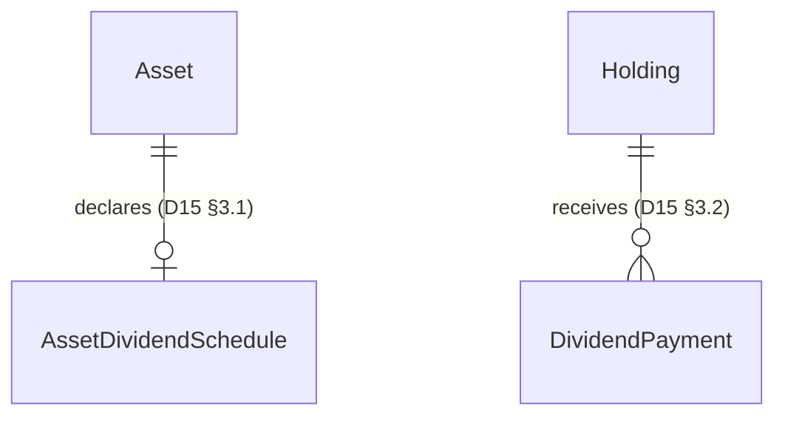

# Spec D15 — Dividend Tracking

**Status:** Approved
**Type:** Domain capability
**References:** Spec D02 (Portfolio Management), Spec D03 (Asset Holdings, Purchase Lots & Sales), Spec D04 (FX Calculation Engine), Spec D06 (Price Levels, Alerts & Analysis History), Spec D08 (Internationalization), Spec D09 (Market & FX Data Integration), Spec D10 (Frontend Architecture), Spec D11 (Roles & Permissions), Spec D12 (Multi-Provider Cascade), Spec D13 (Realized Gain Accounting), Changeset C17 (Date-Based Alerts)

**Note on numbering:** the next free slot after D13 is **D15**, not D14. D14 is already reserved (see Changeset C08 §11.2, §14 and `backend/app/config.py`'s `PortfolioPerformanceConfig`) for a future **"Portfolio Performance Analytics"** spec covering CAGR/MDD/Volatility/Sharpe and persisted portfolio value history. That work is unrelated to dividends and must keep its own number.

---

## 1. Purpose

Let the user track dividend-paying holdings end to end:

1. **See the dividend policy** of an asset they hold: how often it pays, how much, and when the next payment is expected — optionally surfaced as a reminder.
2. **Record actual dividend payments received** (date + gross amount), so that dividend income counts toward the holding's and portfolio's overall gain, the same way capital gains already do.
3. **See a coverage indicator**: how many years of the currently-declared annual dividend it would take to recoup the average purchase price of the position — a plain, at-a-glance answer to "is this position paying for itself."

This closes a gap explicit in Spec D13 §2, which defined P&L as `Unrealized + Realized` — a definition that only holds for assets with no cash distributions. For dividend payers, that formula understates the investor's actual return.

---

## 2. Terminology

Three components of P&L now exist side by side (extends D13 §2):

- **Unrealized P&L** (C08 §3): paper gain/loss of currently-held units.
- **Realized P&L** (D13): confirmed gain/loss from FIFO-accounted sales.
- **Dividend income** (introduced here): cash the user has actually received in dividends on a holding, converted to base currency at the time of each payment. Immutable once recorded, exactly like a sale's realized-gain fields.

```
Total P&L = Unrealized P&L + Realized P&L + Dividend Income
```

Dividend income is **deliberately kept separate** from `realized_pnl` rather than folded into it — `realized_pnl` is defined by D13 specifically as FIFO sale gain for (eventual) Spanish capital-gains tax reporting; dividends are taxed differently in Spain (investment income, not capital gain) and mixing the two buckets would corrupt both a clean UI breakdown and any future tax-report export (already flagged as future work in D13 §14).

A second, distinct concept is the **declared dividend schedule** — the company's/fund's dividend policy (frequency, amount per payment, next expected date). This is forward-looking and estimated; it is not a ledger of cash the user has received. The two concepts (schedule vs. payment) map to two different entities (§3).

---

## 3. Data model

### 3.1 `AssetDividendSchedule` — the declared policy (one per asset)

Dividend policy is a fact about the **company or fund**, not about any one user's holding of it. Two different users (or the same user in two different portfolios) holding the same ticker see the same schedule. This mirrors how `Asset` and `AssetPriceHistory` are already shared reference data (D03 §3.1, D09 §5.1) rather than duplicated per holding — the same architectural reason applies here, and it leaves the door open for an automatic-fetch upgrade later (§9) without a data-model change, since the fetch would then run once per `Asset`, not once per holding.

| Field | Type | Notes |
|---|---|---|
| `id` | UUID | Primary key. |
| `asset_id` | UUID | FK to `assets.id`, **unique** — at most one schedule row per asset. |
| `frequency` | enum | `monthly` \| `quarterly` \| `semiannual` \| `annual` \| `irregular`. Drives the annualization in §4. |
| `amount_type` | enum | **Added in Changeset C22**, user feedback: companies announce dividends either as a fixed currency amount or as a percentage of the share price, and the user wants to enter the figure exactly as announced. `nominal` \| `percentage`. Default `nominal`. |
| `amount_per_payment` | NUMERIC(18,8) | Declared amount per payment, **gross**. If `amount_type='nominal'`: a currency amount per share, in the asset's `quote_currency`. If `amount_type='percentage'`: a plain percentage number (e.g. `2.5` for "2.5%") of the current share price — converted to a nominal per-share amount at computation time (§4.1) using the current price, the same cache-only "last known price" pattern already used for FX (Changeset C19). |
| `next_payment_date` | date, nullable | Best-known estimate of the next pay date. Null if unknown. |
| `origin` | enum | `manual` \| `auto`. Always `manual` in v1 (§9) — the column exists now so a future automatic-fetch changeset is additive, not a migration that touches every existing row's semantics (same reasoning as `Lot.fx_rate_origin`, D03 §3.3). |
| `notes` | text, nullable | Free-form, e.g. "Cut from $0.30 to $0.22 in Q2 2026." |
| `created_at`, `updated_at` | timestamp | Standard. |

Unlike `AssetPriceHistory` (an append-only series) or `PriceLevel` (which keeps a full history table, D06 §4), `AssetDividendSchedule` is a **single current-state row per asset**, edited in place — the same simplicity choice already made for `DateAlert` (C17: "no immutable history table... status is a pure function... computed at read time"). If a company changes its dividend, the user edits the existing row; no change history is retained in v1. See §11 for the rationale and the explicit scope boundary this implies.

### 3.2 `DividendPayment` — actual income received (per holding)

This is the user's personal cash-flow record: "I received this amount, on this date, on this holding." It belongs to the `Holding`, not the `Asset` — it is inherently personal data, structurally the same kind of record as a `Sale` (D03 §3.4), just without FIFO consumption.

| Field | Type | Notes |
|---|---|---|
| `id` | UUID | Primary key. |
| `holding_id` | UUID | FK to `holdings.id`, `ondelete="CASCADE"`. |
| `payment_date` | date | The date the dividend was actually paid/received. |
| `gross_amount_quote` | NUMERIC(18,8) | **Total gross amount received**, in the asset's `quote_currency` — matches what appears on the user's brokerage statement. Not a per-share figure; the user does not need to also know the exact unit count on the payment date. |
| `fx_rate_at_payment` | NUMERIC(18,8), nullable | Rate between quote currency and portfolio base currency on `payment_date`, resolved the same way as `Lot.fx_rate_at_purchase` / `Sale.fx_rate_at_sale` (D09 §7). Null only if `fx_rate_origin = manual_pending`. |
| `fx_rate_origin` | enum | `auto` \| `manual` \| `corrected` \| `manual_pending`. Same enum, same semantics as `Lot`/`Sale`. |
| `gross_amount_base` | NUMERIC(18,8), nullable | `gross_amount_quote × fx_rate_at_payment`, computed once at creation and never recomputed — same immutability pattern as `Sale.realized_gain_base` (D13 §4.1). Null only if FX was unresolved at creation (`manual_pending`) and never corrected. |
| `notes` | text, nullable | Optional, max 500 characters (API-layer enforced, same convention as `Sale.notes`/"reason"). |
| `created_at`, `updated_at` | timestamp | Standard. |

**Explicitly not modeled in v1** (see §12): withholding tax, per-share breakdown, and any link back to which `Lot`s were held at payment time. The user records the gross cash amount only, matching what they were asked for.

### 3.3 ERD addition



---

## 4. The dividend-coverage indicator

### 4.1 Formula

```
payments_per_year(frequency) = 12 (monthly) | 4 (quarterly) | 2 (semiannual) | 1 (annual) | undefined (irregular)

annualized_dividend_per_share_quote = schedule.amount_per_payment × payments_per_year

annualized_dividend_per_share_base = annualized_dividend_per_share_quote × fx_rate_current
    (fx_rate_current = the same "last known" FX rate already used for unrealized_pnl —
     summary_service._last_known() against the FX series — since this is a forward-looking
     estimate, not a historical fact to freeze)

dividend_coverage_years = avg_purchase_price_base / annualized_dividend_per_share_base
```

`avg_purchase_price_base` is **already computed** by `lot_service`'s holding-aggregate function (the "AVG Cost" the user sees today) — this spec reuses it as-is, no new cost-basis calculation is introduced.

### 4.2 Worked example (from the project owner's own numbers)

- Lot 1: buy at €10.
- Lot 2 (averaging down): buy at €6.
- Weighted average cost = €8 (already computed today).
- Declared schedule: `annual`, `amount_per_payment = €1.00`.
- `annualized_dividend_per_share_base = €1.00 × 1 = €1.00`.
- `dividend_coverage_years = €8 / €1 = 8 years`.

### 4.3 Edge cases

- No schedule declared for the asset → `dividend_coverage_years = None`, UI shows "—" / "Sin datos de dividendo".
- `frequency = irregular` → `payments_per_year` is undefined → `dividend_coverage_years = None`. Irregular payers (special/one-off dividends) don't have a meaningful annualized run-rate.
- Holding fully sold (`active_units = 0`, `avg_purchase_price_base` reads as zero per the existing aggregate) → indicator not applicable, same "N/A" treatment as the rest of the sold-out holding display (D13 §5.5, §10).
- `annualized_dividend_per_share_base = 0` (schedule declared with a zero amount, e.g. a suspended dividend) → `None`, not a division by zero.

### 4.4 Where it's surfaced

Computed on demand, never persisted or snapshotted (same treatment as `unrealized_pnl` — it changes whenever `avg_purchase_price_base`, the schedule, or the FX rate changes; no historical value of it is meaningful). Exposed as a new nullable field on the holding-detail response and on `HoldingPnl` (§7), but rendered prominently only on the asset detail screen (Screen 6) next to the existing "AVG Cost" figure — deliberately **not** added to the compact portfolio-list / dashboard row summaries (D13 §9/§10), to avoid cluttering list rows with a secondary metric; those rows already carry three numbers (units, invested, P&L).

---

## 5. Recording flow — declaring/editing the dividend schedule

### 5.1 Where

On the asset detail screen (Screen 6), a new **"Dividendos"** section, alongside the existing indicator/price-level/analysis tabs. Shows the current schedule (if any) with an "Editar" action, or an empty state with "Declarar dividendo" if none exists yet.

### 5.2 Form fields

- **Frecuencia** — select: Mensual / Trimestral / Semestral / Anual / Irregular.
- **Importe por pago** — number, > 0, in the asset's quote currency (label shown statically, e.g. "USD").
- **Próximo pago (estimado)** — optional date picker.
- **Notas** — optional free text, max 500 characters.

Submitting **upserts** the single `AssetDividendSchedule` row for that asset (create if absent, overwrite if present) — there is no separate "create" vs. "edit" screen, consistent with §3.1's single-current-row design.

### 5.3 Automatic reminder on save

Per the project owner's explicit instruction, **no new alerting mechanism is introduced** — the existing `DateAlert` (C17) is reused exactly as it stands today, with no schema change to it.

When the schedule is saved with a non-null `next_payment_date`:

1. The service finds every `Holding` referencing this `asset_id` (across all portfolios, all users) with `active_units > 0` — the same "fan out from Asset to affected Holdings" shape D06's alert-crossing engine already uses when a new price arrives for an asset (evaluate impact across every `PriceLevel` of every holding of that asset).
2. For each such holding, it looks for an **existing** `DateAlert` whose `description` starts with the fixed marker prefix `"Dividendo: {ticker}"` (case-sensitive, generated by the system, never by the user for other alerts — collision with a coincidentally similar user-authored description is accepted as an unlikely v1 edge case). If found, that alert's `alert_date` and `description` are **updated in place**. If not found, a **new** `DateAlert` is created with `alert_date = next_payment_date` and `description = "Dividendo: {ticker} — {amount}{currency}/unidad"`.
3. This is a plain upsert against the existing `DateAlert` CRUD (`create_date_alert` / `edit_date_alert`, already implemented) — no new columns, no new table, no new alert-evaluation logic.

If `next_payment_date` is cleared (edited to null) or the schedule is deleted, any `DateAlert` matching the marker prefix for that asset's holdings is deleted the same way.

**Known v1 limitation, explicitly accepted:** because the link between a schedule and its generated alert is a description-string convention rather than a foreign key, a user who manually retitles the generated alert's description to something that no longer starts with the marker prefix will get a *second*, duplicate alert on the next schedule edit. This mirrors the spirit of D13 §11's "delete and recreate" trade-off: correct, not elegant, acceptable for a personal-use MVP.

### 5.4 Holding sold out

When a sale reduces a holding to `active_units = 0` (D13 §5.5), any dividend-marker `DateAlert` for that holding is removed at the same time — a reminder for a dividend on shares you no longer own is actively misleading, unlike the sales/analysis history, which is deliberately preserved.

---

## 6. Recording flow — logging a received payment

### 6.1 Where

On the same asset detail screen's "Dividendos" section, below the schedule: a **"Registrar cobro"** action opens an inline form (same UI pattern as the sale form from D13 §5.1 — an inline toggled section, not a modal, per this codebase's established convention).

### 6.2 Form fields

- **Fecha de cobro** — date picker, defaults to today.
- **Importe bruto cobrado** — number, > 0, in the asset's quote currency. Explicitly labeled "bruto" (gross) — no tax/withholding modeling in v1 (§12).
- **Notas** — optional, max 500 characters.

On submit, the backend resolves `fx_rate_at_payment` the same way `create_sale` resolves `fx_rate_at_sale` (D09 §7 auto-fetch, falling back to `manual_pending` if unavailable), computes `gross_amount_base`, and persists.

### 6.3 Payment history

Below the form, a chronological list of recorded payments for the holding (`payment_date` descending): date, gross amount (quote currency), gross amount in base currency, notes (truncated). Each row has a delete action.

---

## 7. Impact on P&L aggregates

Extends D13 §8/§10 with a third component everywhere `unrealized_pnl + realized_pnl` is currently computed:

- **`PortfolioSummary`** (`backend/app/api/portfolio_schemas.py`) gains `dividend_income` (Decimal, base currency): sum of `gross_amount_base` across every `DividendPayment` in the portfolio, **as of today** — a payment dated after today is excluded until its date arrives, mirroring the exact future-dated-sale exclusion bug D13/C20 §6 already found and fixed for `realized_pnl`. This rule is stated here up front specifically so the implementing changeset doesn't have to rediscover it.
- **`HoldingPnl`** (`summary_service.py`) gains `dividend_income` per holding, same future-date rule.
- Every existing `total_pnl = unrealized_pnl + realized_pnl` computation (`summary_service.py` — the portfolio-level total in `compute_summary`, and the per-holding total in `_compute_holding_pnl` / `get_holding_summaries`) becomes `total_pnl = unrealized_pnl + realized_pnl + dividend_income`.
- Cache invalidation (C08 §5, extended by D13 §8.1) gains two new triggers: dividend payment created, dividend payment deleted. (Schedule create/edit does **not** invalidate the P&L cache — a schedule has no effect on any P&L figure, only on the coverage indicator and alerts.)

### 7.1 Portfolio header tile

A new tile, **"Dividendos"**, alongside the existing "P&L Latente" / "P&L Real" tiles (C08 §7, D13 §8), showing cumulative `dividend_income` in the portfolio's base currency. Always non-negative (dividends can't be negative), so no red/green color-coding is needed — rendered in the same neutral/positive style as "Invertido".

**Added in Changeset C22**, user feedback: "P&L Latente" is deliberately narrow (paper gain from price movement only, per C08/D13 — unchanged by this spec) but the header had *no* tile showing the combined result, so recording a dividend payment appeared to have no visible effect at the header level (it only showed up in the list/dashboard rows, §7.2). A sixth tile, **"P&L Total"**, is added: `unrealized_pnl + realized_pnl + dividend_income`, against `total_invested` (same convention as `PortfolioListSummary.total_pnl_pct`). `PortfolioSummary` gains `total_pnl`/`total_pnl_pct` fields for it. "P&L Latente" itself is untouched — it still means exactly what it meant before this spec existed.

### 7.2 List and row summaries (D13 §9/§10)

The `P&L +€X (+Y%)` figure already shown on the Portfolios-list rows and the dashboard asset rows now reflects the three-term total. No new visual element is required there — dividend income simply flows into the number that's already displayed, consistent with the project owner's framing ("la ganancia es 6, incluyendo el dividendo").

---

## 8. Backend services and endpoints

### 8.1 Schedule (asset-scoped, mirrors `assets.py`'s existing `PATCH /assets/{asset_id}`)

- `GET /assets/{asset_id}/dividend-schedule` — returns the schedule or 404 if none declared. Guarded by `dividend.schedule.view`.
- `PUT /assets/{asset_id}/dividend-schedule` — upsert (create or overwrite). Guarded by `dividend.schedule.edit`. Triggers the `DateAlert` fan-out from §5.3.
- `DELETE /assets/{asset_id}/dividend-schedule` — removes the schedule and its generated alerts (§5.3). Guarded by `dividend.schedule.edit`.

Since `Asset` is shared reference data across all users (same as today), any authenticated user holding that asset can edit its schedule — the same shared-data model already accepted for `PATCH /assets/{asset_id}` (ticker/name/market corrections). No per-user schedule ownership exists, matching the "single-user MVP, architecture prepared for multi-user" posture already recorded for this project; concurrent-edit conflicts are last-write-wins, same as `AssetPriceHistory`.

### 8.2 Payments (holding-scoped, mirrors `holdings.py`'s sales endpoints per the C20 file-structure deviation)

All nested under `/portfolios/{portfolio_id}/holdings/{holding_id}/dividend-payments`:

- `GET .../dividend-payments` — list for the holding, newest first. Guarded by `dividend.payment.view`.
- `POST .../dividend-payments` — create. Guarded by `dividend.payment.create`.
- `PATCH .../dividend-payments/{id}` — edit `notes` only (financial fields locked, same immutability rationale as D13 §11 — no FIFO chain to protect here, but consistency with the rest of the codebase's transactional-record pattern is preferred over inventing a new editability rule). Guarded by `dividend.payment.edit_notes`.
- `DELETE .../dividend-payments/{id}` — hard delete. Guarded by `dividend.payment.delete`.

### 8.3 Coverage indicator

No dedicated endpoint — `dividend_coverage_years` (§4) is added as a field on the existing holding-detail response and on `HoldingPnlResponse` (`d03_schemas.py`), computed inline by `summary_service`/`lot_service` alongside the figures they already return.

---

## 9. Automatic fetch of the dividend schedule — researched, deferred

The project owner asked that this be checked first, before defaulting to manual entry. Findings, current as of this spec's drafting:

| Provider (already integrated per D09/D12) | Dividend data on the currently-used tier? |
|---|---|
| **Twelve Data** (default market data provider) | Dividends are fundamentals data, gated behind the **Grow plan and above** — not available on the free Basic plan this project uses. |
| **Finnhub** (alternative provider) | The dividends endpoint was moved from free to **premium-only** in 2020 and stays that way; a free-tier key gets `403 Forbidden`. |
| **EODHD** (cascade fallback, D12) | Nominally exists on the free plan, but requires **manually contacting EODHD support to activate** access, and this provider already has this project's tightest quota (20 calls/day, reserved by D12 as the last-resort fallback for 1-year price history). Spending part of that already-scarce budget on dividend lookups, on top of a manual activation step outside the app, is not a good trade for v1.

**Conclusion: no automatic fetch in v1.** All three providers wired into this project either require a paid upgrade or would consume/require action against an already-constrained resource. `AssetDividendSchedule.origin` (§3.1) is `manual`-only for now; the `auto` value and the `origin` column exist purely so that if a paid tier or a fourth provider is added later, wiring it in is additive to this data model, not a breaking migration.

---

## 10. Editability

- **Schedule**: fully editable in place at any time (§5.2) — it's a declared estimate, not an immutable transactional record, so D13's "immutable except reason" philosophy does not apply here. Editing re-runs the alert upsert (§5.3).
- **Payments**: immutable except `notes`, mirroring `Sale` (D13 §11) — `payment_date`, `gross_amount_quote`, `fx_rate_at_payment`, `gross_amount_base` are locked once created. Corrections are delete-and-recreate.

---

## 11. Rationale for the single-current-row schedule design

`PriceLevel` (D06) keeps a full immutable history table because every touch/edit is an analytically meaningful event for a price target the user is actively trading around. A dividend schedule is different: it's a slowly-changing fact about a company (a dividend cut or raise happens at most a few times a year, if ever), and the user is not expected to want to browse "how this company's declared dividend evolved over time" inside this app — that's exactly the kind of historical fact a financial data provider, not a personal portfolio tracker, is the right place to keep. Building a `AssetDividendScheduleHistory` table for that would be speculative complexity for a need nobody has expressed. If it's wanted later, `notes` already gives the user a manual way to leave a trail ("Cut from $0.30 to $0.22").

---

## 12. Out of scope for v1

- **Automatic fetch of the dividend schedule** — researched in §9, deferred; not viable on any currently-integrated provider's accessible tier.
- **Withholding tax modeling** on dividend payments (Spanish/foreign withholding, double-taxation treaties). The user records the gross amount only; net-of-tax reporting is a separate, legally-sensitive concern (same category of deferral as D13 §14's tax report export).
- **Per-share breakdown or unit-count-at-payment-date** on `DividendPayment` — only the total gross amount is recorded, per the project owner's explicit request.
- **Historical versioning of the declared schedule** (§11).
- **Automatic roll-forward of `next_payment_date`** to the next cycle once a payment date passes. The field is manually maintained; the user updates it when they learn the next date. A scheduled job that projects forward from `frequency` would be a natural v2 addition but is out of scope now — it would require new recurring-job infrastructure beyond "reuse the alert system as-is," which the project owner explicitly asked to avoid this round.
- **Dividend reinvestment (DRIP) modeling** — a recorded payment is cash income; if the user reinvests it, they record a separate purchase `Lot` the normal way (D03 §4). No automatic linkage between a `DividendPayment` and a resulting `Lot`.
- **Special/one-off dividends distinguished from regular ones** beyond the `irregular` frequency value, which simply excludes them from the annualized-coverage indicator (§4.3).
- **Currency other than the asset's `quote_currency`** for `amount_per_payment`/`gross_amount_quote` — same convention as `Lot`/`Sale`.

---

## 13. Impact on other specs

| Other spec | Impact |
|---|---|
| **D03 §3.1, §3.2** | `Asset` gains an optional `AssetDividendSchedule`; `Holding` gains a `DividendPayment` collection. |
| **D04** | Unchanged — this spec reuses the FX resolution helper D04/D09 already expose to `Lot`/`Sale`, no new FX logic. |
| **D06 / C17** | `DateAlert` schema and engine **unchanged**, per explicit instruction — reused via the description-marker upsert convention in §5.3. |
| **D09 §7** | FX rate resolution for `fx_rate_at_payment` reuses the existing per-date resolution path exactly. |
| **D12** | No new provider wired in v1; §9 documents why, for when this is revisited. |
| **D13 §2, §8, §9, §10** | The additive P&L formula gains a third term everywhere it appears; `PortfolioSummary`, `HoldingPnl`, portfolio-list and asset-row summaries all gain `dividend_income`. |
| **C08 §7** | Portfolio header gains a "Dividendos" tile. |
| **D10** | New surfaces: "Dividendos" section on the asset detail screen (schedule + payment history), no new routes/screens. |
| **D11 §5.1** | Six new permission codes (§14). |
| **00f** | No new configuration keys (the `origin` field's `auto` value is unused until a future changeset adds a provider). |
| **00e** | No new environment variables. |

---

## 14. Permissions (Spec D11)

Six new permission codes, added to `roles_catalog.yaml` and assigned to both `investor` and `administrator`:

- `dividend.schedule.view`
- `dividend.schedule.edit` (covers create/update/delete of the single schedule row)
- `dividend.payment.view`
- `dividend.payment.create`
- `dividend.payment.edit_notes`
- `dividend.payment.delete`

---

## 15. Suggested implementation order (for the implementing changeset)

Mirrors C20's low-to-high-impact ordering:

1. `AssetDividendSchedule` + `DividendPayment` models, migration, permissions catalog entries.
2. `DividendPayment` CRUD service + endpoints (no dependency on the schedule; delivers "record what I received" in isolation, independently testable).
3. `AssetDividendSchedule` CRUD service + endpoints, **without** the alert fan-out yet.
4. `summary_service` extension: `dividend_income` on `PortfolioSummary`/`HoldingPnl`, three-term `total_pnl`, cache invalidation triggers, future-date exclusion (unit-tested explicitly, given C20 already proved this exact bug is easy to reintroduce).
5. `dividend_coverage_years` computation (§4), added to the holding-detail response.
6. Alert fan-out on schedule save/delete (§5.3) — deliberately last among the backend steps since it's the only piece touching another spec's territory (`DateAlert`).
7. Frontend: "Dividendos" section on the asset detail screen (schedule form + payment form + payment history).
8. Frontend: portfolio header "Dividendos" tile; list/row P&L figures updated to the three-term total.
9. Translations, i18n validator pass.

---

## 16. App version

Per this project's versioning convention (`frontend/src/version.ts`), adding this new domain spec bumps the 3rd segment and resets the 4th: `1.0.1.8` → `1.0.2.0`, matching the project owner's own framing of this as "V1.0.2.0."
