# Entity Relationship Diagram — v1

This diagram visualizes the complete data model defined across Specs D01–D09. It is rendered automatically by GitHub, GitLab, and the Markdown preview in VS Code (with a Mermaid extension).

The diagram groups entities by the spec that owns them, and uses standard crow's-foot notation:

- `||--o{` : one-to-many (parent ←→ many children, children mandatory parent)
- `||--|{` : one-to-many (at least one child required)
- `o|--o{` : zero-or-one to many

```mermaid
erDiagram

    User ||--o{ Portfolio : "owns (D02 §11)"
    User ||--o{ UploadedFile : "uploaded (D07 §8.1)"

    Portfolio ||--o{ Holding : "contains (D03 §3.2)"

    Asset ||--o{ Holding : "referenced by (D03 §3.2)"
    Asset ||--o{ AssetPriceHistory : "has prices (D09 §5.1)"
    Asset ||--o| AssetDividendSchedule : "declares (D15 §3.1)"

    Holding ||--o{ Lot : "made of (D03 §3.3)"
    Holding ||--o{ Sale : "and sales (D03 §3.4)"
    Holding ||--o{ PriceLevel : "tracks targets (D06 §3)"
    Holding ||--o{ PriceLevelHistoryEntry : "analysis history (D06 §4)"
    Holding ||--o{ AnalysisJob : "PDF analyses (D07 §6)"
    Holding ||--o{ AnalysisReport : "analysis results (D07 §8.2)"
    Holding ||--o{ DividendPayment : "receives (D15 §3.2)"

    Lot ||--o{ SaleLotConsumption : "consumed by (D03 §3.5)"
    Sale ||--|{ SaleLotConsumption : "consumes lots FIFO (D03 §7.2)"

    Indicator ||--o{ IndicatorSnapshot : "produces values (D05 §5)"

    Asset ||--o{ IndicatorSnapshot : "indicator for asset (D05 §5)"
    Portfolio ||--o{ IndicatorSnapshot : "indicator for portfolio (D05 §5)"

    UploadedFile ||--o| AnalysisJob : "fed into (D07 §6)"
    AnalysisJob ||--o| AnalysisReport : "produces on success (D07 §6.1)"
    AnalysisReport ||--o{ IndicatorSnapshot : "feeds fundamentals (D07 §9.2)"

    User {
        UUID id PK
        string email UK
        enum auth_provider "google|microsoft|password|guest"
        string password_hash "null unless password"
        string display_name
        string preferred_language "es|en in v1"
        timestamp created_at
    }

    Portfolio {
        UUID id PK
        UUID user_id FK
        string name "editable, not unique"
        string base_currency "EUR|USD|GBP|JPY|CHF|CAD|AUD, immutable"
        enum status "active|archived"
        timestamp created_at
        timestamp updated_at
        timestamp archived_at "null if active"
    }

    Asset {
        UUID id PK
        string ticker UK
        string name
        enum asset_type "stock|etf|fund|crypto"
        string quote_currency
        string market "null for crypto"
        timestamp created_at
    }

    Holding {
        UUID id PK
        UUID portfolio_id FK
        UUID asset_id FK
        timestamp created_at
        timestamp updated_at
    }

    Lot {
        UUID id PK
        UUID holding_id FK
        date purchase_date
        NUMERIC quantity "> 0"
        NUMERIC unit_price "in quote currency"
        NUMERIC fx_rate_at_purchase "null if manual_pending"
        enum fx_rate_origin "auto|manual|corrected|manual_pending"
        text notes
        NUMERIC quantity_consumed "tracks FIFO usage"
        timestamp created_at
        timestamp updated_at
    }

    Sale {
        UUID id PK
        UUID holding_id FK
        date sale_date
        NUMERIC quantity "> 0"
        NUMERIC unit_price "in quote currency"
        NUMERIC fx_rate_at_sale "null if manual_pending"
        enum fx_rate_origin "auto|manual|corrected|manual_pending"
        text notes
        timestamp created_at
        timestamp updated_at
    }

    SaleLotConsumption {
        UUID id PK
        UUID sale_id FK
        UUID lot_id FK
        NUMERIC quantity_consumed "> 0"
    }

    AssetDividendSchedule {
        UUID id PK
        UUID asset_id FK "unique, one schedule per asset"
        enum frequency "monthly|quarterly|semiannual|annual|irregular"
        NUMERIC amount_per_payment "gross, in quote currency"
        date next_payment_date "nullable, best estimate"
        enum origin "manual|auto, manual-only in v1"
        text notes
        timestamp created_at
        timestamp updated_at
    }

    DividendPayment {
        UUID id PK
        UUID holding_id FK
        date payment_date
        NUMERIC gross_amount_quote "total gross received, in quote currency"
        NUMERIC fx_rate_at_payment "null if manual_pending"
        enum fx_rate_origin "auto|manual|corrected|manual_pending"
        NUMERIC gross_amount_base "immutable once computed"
        text notes
        timestamp created_at
        timestamp updated_at
    }

    Indicator {
        UUID id PK
        string code UK "from seed file"
        string name_key "i18n"
        string description_key "English in v1"
        enum scope "asset|portfolio"
        enum nature "technical|fundamental|portfolio_kpi"
        enum data_type "quantitative|qualitative"
        string unit
        string calculator_code
        string ai_extraction_key "for on_ai_analysis"
        enum update_strategy "scheduled_daily|on_ai_analysis|on_demand_calculated"
        JSONB threshold_config
        boolean active
    }

    IndicatorSnapshot {
        UUID id PK
        UUID indicator_id FK
        enum subject_type "asset|portfolio"
        UUID subject_id "FK to Asset or Portfolio"
        date as_of_date
        NUMERIC value_numeric "for quantitative"
        string value_text "for qualitative"
        enum source "scheduled_job|ai_analysis|on_demand_calc|manual_override"
        string source_ref "AnalysisReport.id when source=ai_analysis"
        timestamp created_at
    }

    PriceLevel {
        UUID id PK
        UUID holding_id FK
        enum direction "buy|sell"
        NUMERIC target_price "in quote currency"
        text note
        enum status "armed|touched"
        timestamp created_at
        timestamp updated_at
        timestamp touched_at
        NUMERIC touched_at_close_price
        date touched_at_close_date
    }

    PriceLevelHistoryEntry {
        UUID id PK
        UUID holding_id FK
        UUID originating_level_id "not a constraint"
        enum event_type "created|edited|touched|removed"
        timestamp event_at
        enum direction "buy|sell, snapshotted"
        NUMERIC target_price "snapshotted"
        text note "snapshotted"
        NUMERIC asset_price_at_event
        timestamp created_at
    }

    AnalysisJob {
        UUID id PK
        UUID holding_id FK
        UUID uploaded_file_id FK
        enum provider "anthropic|openai|gemini"
        string model_version
        enum status "queued|running|succeeded|failed"
        integer attempt_count
        text last_error
        UUID analysis_report_id "null until success"
        timestamp created_at
        timestamp started_at
        timestamp completed_at
    }

    AnalysisReport {
        UUID id PK
        UUID holding_id FK
        UUID uploaded_file_id FK
        UUID analysis_job_id FK
        date report_date
        enum provider
        string model_version
        JSONB extracted_metrics
        text executive_summary
        enum global_signal "bullish|neutral|bearish"
        text confidence_notes
        JSONB raw_response
        timestamp created_at
    }

    UploadedFile {
        UUID id PK
        UUID user_id FK
        string original_filename
        string mime_type "application/pdf"
        integer size_bytes
        BYTEA content
        timestamp created_at
    }

    AssetPriceHistory {
        UUID id PK
        UUID asset_id FK
        date as_of_date
        NUMERIC close_price "in asset quote currency"
        enum provider "twelve_data|finnhub"
        timestamp fetched_at
    }

    FxRateHistory {
        UUID id PK
        string quote_currency
        string base_currency
        date as_of_date
        NUMERIC rate "1 unit quote → rate units base"
        string provider "frankfurter in v1"
        timestamp fetched_at
    }
```

---

## Reading guide

The entities cluster into six functional groups:

1. **Identity & ownership**: `User` → `Portfolio`. Every other entity ultimately belongs to a user via its portfolio (with the exception of shared reference data like `Asset` and historical data tables).

2. **Asset holdings core**: `Asset` ↔ `Holding` ↔ `Lot` ↔ `Sale` ↔ `SaleLotConsumption`. The `SaleLotConsumption` junction is the heart of FIFO accounting: it records exactly which lots each sale consumed. Allows future realized-gain reporting without data migration.

3. **Indicators**: `Indicator` (catalog) ↔ `IndicatorSnapshot`. One unified snapshot table for all indicators, asset-level and portfolio-level, technical and fundamental. `subject_type` + `subject_id` is a polymorphic link to either `Asset` or `Portfolio` (enforced at the service layer, not by a single FK constraint).

4. **Price levels & analysis history**: `PriceLevel` (active, deletable) and `PriceLevelHistoryEntry` (immutable). Every state change of a `PriceLevel` writes a corresponding history entry in the same transaction. The history survives deletion of the active level — the architectural reconciliation of "I want to delete levels" + "but my analysis should never be lost."

5. **AI analysis pipeline**: `UploadedFile` → `AnalysisJob` → `AnalysisReport`. The job is the async unit of work (Celery); the report is the materialized outcome. The report feeds `IndicatorSnapshot`s for fundamental indicators via the cross-spec link in D07 §9.2.

6. **External data persistence**: `AssetPriceHistory` and `FxRateHistory`. The local cache of all data ever fetched from external providers (D09). Immutable once written, per D09 §5.3.

---

## Cardinality summary

| Relationship | Cardinality | Notes |
|---|---|---|
| User → Portfolio | 1 to N (N ≤ `portfolios.max_active_per_user` active) | Archived portfolios don't count against the cap. |
| Portfolio → Holding | 1 to N | One per `(portfolio, asset)`. |
| Asset → Holding | 1 to N | The same asset can appear in many users' portfolios. |
| Holding → Lot | 1 to N | At least one lot exists during the holding's life. |
| Holding → Sale | 1 to N | Zero is valid; not every holding has been partially sold. |
| Sale → SaleLotConsumption | 1 to N (at least one) | A sale always consumes at least one lot. |
| Lot → SaleLotConsumption | 1 to N (zero is valid) | A lot may be wholly unconsumed. |
| Indicator → IndicatorSnapshot | 1 to N (zero is valid for `on_demand_calculated`) | |
| Holding → PriceLevel | 1 to N (zero is valid) | A user may not have defined any targets yet. |
| Holding → PriceLevelHistoryEntry | 1 to N (zero is valid) | Entries persist even after parent PriceLevel deletion. |
| Holding → AnalysisJob | 1 to N (zero is valid) | |
| AnalysisJob → AnalysisReport | 1 to 1 (when succeeded) | Failed jobs produce no report. |
| User → UploadedFile | 1 to N | Uploads survive their user's interaction with them. |

---

## Notes for the implementer

- **Polymorphic FK on `IndicatorSnapshot.subject_id`**: there is no database-level foreign key constraint between `subject_id` and either `Asset` or `Portfolio`; the spec requires the service layer to enforce that `subject_id` points to the correct table based on `subject_type`. This is a known anti-pattern from the strict relational view, accepted here for catalog flexibility. The integrity invariant lives in the service layer and is enforced by tests.

- **`originating_level_id` in `PriceLevelHistoryEntry`** is intentionally **not** a foreign key. The originating `PriceLevel` may no longer exist (deleted by the user). The value is preserved so history can be grouped by which level it pertained to.

- **Cascading deletes** are explicit in the spec text rather than implemented purely as `ON DELETE CASCADE` at the database level. The implementer is encouraged to use Postgres `ON DELETE` clauses where natural, but the transactional rules — especially the price-level-then-history-entry write order in D06 §4.1 — must be enforced at the application layer for correctness.

- **`AssetPriceHistory.close_price`** and **`FxRateHistory.rate`** are immutable once written (D09 §5.3). The implementer should not write logic that updates these rows; the only mutation pattern is `INSERT IGNORE` (or its Postgres equivalent, `INSERT ... ON CONFLICT DO NOTHING`).
